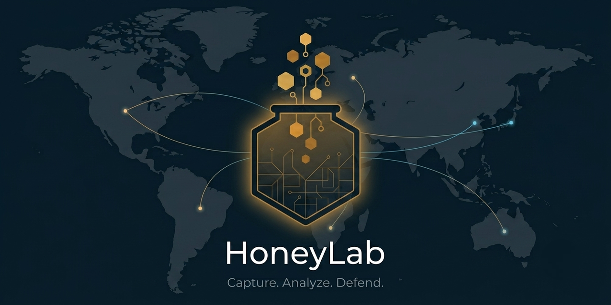

# HoneyLab

**Download HoneyLab:** [HoneyLab OVA](https://mega.nz/folder/0qNmhCTJ#rm37j4yC9V0JZC1sJLc2yQ)

## Overview

HoneyLab is a pre-configured, ready-to-import multi-service honeypot delivered as a single virtual machine (**Ubuntu Server 26.04 LTS**, built for **VMware**). It combines several decoy services with a full detection and analysis pipeline, so you can study real attacker behaviour without touching a production system — just download the VM, import it, run the first-time wizard, and start capturing.

Everything is wired end to end: the honeypots capture SSH, Telnet, FTP, HTTP, MySQL and web attacks; an **ELK** pipeline enriches every event with **GeoIP** and **MITRE ATT&CK** context; **Kibana** visualises it; and **ElastAlert 2** sends email alerts. A bilingual (PT/EN) shell **control panel** with a guided setup wizard ties it all together.

> **Legal notice:** laboratory / research environment. It must only be exposed to the internet with written authorisation. During development it runs on an isolated (NAT) network.

## Features

- Six decoy services in a single VM: SSH, Telnet, FTP, HTTP (fake NAS login), MySQL and a fake website.
- Medium- and low-interaction capture (Cowrie + OpenCanary + SNARE/Tanner): the ideal balance between data richness and safety.
- Full **ELK 8.x** detection pipeline: Filebeat → Logstash → Elasticsearch → Kibana.
- **GeoIP** enrichment (MaxMind GeoLite2) and explicit **MITRE ATT&CK** technique mapping.
- Pre-built Kibana dashboard: attacker GeoIP map, top source IPs, most-tried credentials, executed commands, MITRE distribution and event timeline.
- Email alerting (**ElastAlert 2**) with three rules: SSH brute-force, OpenCanary credential attempts, and web attacks.
- Bilingual (PT/EN) shell control panel that appears automatically on login (console or SSH).
- Guided first-run setup wizard: change the username, VM password and Elasticsearch password, and configure email alerts (with a real SMTP login test).
- Unique per-deployment identity: SSH host keys, **machine-id**, logs and shell history are sanitised at packaging time; host keys are regenerated on first boot.
- Hardened Cowrie that **defeats nmap** service/algorithm fingerprinting.
- Deliberate Tanner isolation (no Docker socket) to prevent container escape.

## Architecture

```
                    Attacker / Scanner
                            │
        ┌───────────────────┼───────────────────────────┐
        │ 22/23             │ 21/80/3306                 │ 8080
        ▼                   ▼                            ▼
     Cowrie             OpenCanary                 SNARE ──► Tanner (Docker)
   (SSH/Telnet)       (FTP/HTTP/MySQL)             (web)     (web analysis)
        │                   │                            │
        └─── logs ──────────┴──────── logs ──────────────┘
                            │
                Filebeat ─► Logstash (GeoIP + MITRE ATT&CK) ─► Elasticsearch
                                                                   │
                                                 Kibana (dashboards) + ElastAlert 2 (email)
```

| Layer                           | Tool                                    | Ports               |
| ------------------------------- | --------------------------------------- | ------------------- |
| Fake SSH/Telnet                 | **Cowrie**                        | 22→2223 / 23→2224 |
| FTP/HTTP/MySQL + fake NAS login | **OpenCanary**                    | 21, 80, 3306        |
| Fake website                    | **SNARE**                         | 8080                |
| Web attack analysis             | **Tanner** (Docker, 5 containers) | 8091                |
| Indexing / search               | **Elasticsearch**                 | 9200 (local)        |
| Dashboards                      | **Kibana**                        | 5601                |
| Log ingestion                   | **Filebeat → Logstash**          | 5044 (local)        |
| Email alerts                    | **ElastAlert 2**                  | —                  |
| Management (real SSH)           | **OpenSSH**                       | **2222**      |

## How it works

The system behaves as a continuous chain, from the attacker's first packet to the alert email in the administrator's inbox: the decoy services capture the interaction, Filebeat ships the logs, Logstash enriches them (GeoIP + MITRE ATT&CK), Elasticsearch stores them, Kibana visualises them, and ElastAlert 2 raises alerts.

### Capture layer

#### Cowrie: SSH & Telnet

A medium-interaction honeypot (v3.0.6, on Twisted) for SSH and Telnet, the most common brute-force targets. It presents a real-looking banner and login, and on success drops the attacker into a **fake shell** (hostname `srv-storage-prod`) with a fake filesystem. Every login attempt, command, uploaded file (stored and hashed) and session metadata is logged as structured JSON. It listens on 2223/2224; `iptables` redirects 22→2223 and 23→2224, so the attacker sees the normal ports.

#### OpenCanary: FTP, HTTP & MySQL

A low-interaction honeypot exposing several decoy services at once and recording every access and credential attempt:

- **FTP (21):** a fake file server logging every authentication attempt.
- **HTTP (80):** the login page of a fake NAS (`DS-STORAGE-01`), capturing submitted credentials.
- **MySQL (3306):** a fake database server logging connection and authentication attempts.

#### SNARE & Tanner: Web

**SNARE** serves a fake website on port 8080 and forwards each request to **Tanner**, which analyses it, classifies the attack type (e.g. SQL Injection, XSS, RFI) and returns a coherent response. Tanner runs in **Docker** across five containers (`tanner`, `tanner_api`, `tanner_web` on 8091, `tanner_redis`, `tanner_phpox`), all with automatic restart.

### Detection & analysis pipeline (ELK)

- **Filebeat** watches the Cowrie, OpenCanary and SNARE/Tanner logs and ships each new event to Logstash (port 5044).
- **Logstash** parses each event, adds geolocation to the source IP (MaxMind GeoLite2) and maps it to a MITRE ATT&CK technique, then writes to Elasticsearch:
  - `cowrie.login.failed` / `login.success` → **T1110** (Brute Force)
  - `cowrie.command.input` → **T1059** (Command and Scripting Interpreter)
  - `cowrie.session.file_download` → **T1105** (Ingress Tool Transfer)
- **Elasticsearch** (8.x, single node, TLS) stores and indexes every event under daily indices (`honeypot-cowrie/opencanary/snare-*`).
- **Kibana** (port 5601) is the main analysis surface, with the pre-built **"Honeypot: Operational View"** dashboard.
- **ElastAlert 2** continuously evaluates the data and emails alerts via Gmail SMTP (three rules: `cowrie-bruteforce`, `opencanary-login`, `snare-attack`).

### Control panel & setup wizard

On login (console or SSH) a bilingual (PT/EN) shell **control panel** appears automatically, showing the VM IP, the live status of every service, and a red warning until the initial setup is complete. Option `0` launches the **setup wizard** with four steps: change the VM username, change the VM password, change the Elasticsearch password (propagated to Logstash and ElastAlert 2), and configure email alerts (validated with a real SMTP login test). Options `1`–`4` open the web interfaces, `5`–`8` tail the live logs, `9` shows detailed service status, and `pt`/`en` switch the language.

## Getting started

### Requirements

| Requirement  | Details                                                                                                                                                                                   |
| ------------ | ----------------------------------------------------------------------------------------------------------------------------------------------------------------------------------------- |
| Hypervisor   | **VMware** Workstation Pro/Player (recommended). VirtualBox works too, but the disk uses an NVMe controller, you may need the Extension Pack and/or to switch it to SATA first.   |
| CPU          | 4 virtual CPUs                                                                                                                                                                            |
| RAM          | 8 GB allocated to the VM                                                                                                                                                                  |
| Disk space   | Virtual disk is**60 GB** (thin-provisioned: ~14 GB used at first, grows as data is captured). Keep at least **~15 GB** free to start, and up to **60 GB** for sustained use. |
| Download     | ~5.7 GB                                                                                                                                                                |
| Network      | **NAT**: isolated lab                                                                                                                                                              |
| Client tools | An SSH client (the built-in Windows one is enough) and a browser for the Kibana dashboards.                                                                                               |

### Download & verify

- Download HoneyLab from [HoneyLab OVA](https://mega.nz/folder/0qNmhCTJ#rm37j4yC9V0JZC1sJLc2yQ).
- Verify the download integrity against the published **SHA256**. U can see it at  [HoneyLab OVA](<HoneyLab%20Checksum%20(ENG).txt>). This is recomended.

### Import & run at VMware

- `File → Open` → select `HoneyLab.ova` → import.
- Make sure the VM network is set to **NAT**, isolated lab.
- Power on the VM. On first boot, unique SSH host keys are generated automatically.

### First boot & SSH access

- The control panel appears by itself once you log in; the **VM IP** is shown at the top.
- From your host, connect to the **management** port 2222:

  ```bash
  ssh -p 2222 superadmin@<VM-IP>
  ```

- Accept the key on first connection and enter the password `honeypot01`. If you see `REMOTE HOST IDENTIFICATION HAS CHANGED`, clear the old key with this and reconnect:

  ```bash
  ssh-keygen -R "[<VM-IP>]:2222"
  ```
  
- Run the setup wizard from the panel by typing `0`.

## Testing

A full, do-not-skip walkthrough (import → wizard → attack every decoy service → confirm everything in Kibana → email alerts) is provided in [`How to test (step by step).txt`](<How%20to%20test%20(step%20by%20step).txt>).

## Default credentials

> Change all of these on first use, via the panel wizard (option `0`).

| Access                              | User           | Password       |
| ----------------------------------- | -------------- | -------------- |
| Management SSH (port**2222**) | `superadmin` | `honeypot01` |
| Elasticsearch / Kibana              | `elastic`    | `changeme`   |

Never expose the management/analysis ports to the internet: **2222** (SSH), **5601** (Kibana), **9200** (Elasticsearch), **5044**/**9600** (Logstash). Only the decoy services (22, 23, 21, 80, 3306, 8080) should be reachable.

## Hardening & security

- **Cowrie vs nmap:** the offered SSH algorithms were aligned with a modern, hardened server (only `aes-ctr` ciphers, `hmac-sha2` MACs, `curve25519`/`ecdh`/`gex-sha256` KEX): this breaks Cowrie's classic signature and defeats `nmap -sV` / `ssh2-enum-algos`. A small patch to Cowrie's `factory.py` was required so it reads the `[ssh] kex` option.
- **Tanner without Docker access:** the Tanner emulators that require *Docker-in-Docker* (LFI, command injection, template injection) are **disabled on purpose**, giving the Docker socket to a honeypot container would allow a container escape to host root.
- **Unique identity & sanitisation:** packaging runs a sanitiser that removes SSH host keys, `machine-id`, shell histories, `authorized_keys`/`known_hosts`, HSTS state, Wi-Fi BSSIDs, cloud-init artefacts, the apt cache and all logs. Host keys are regenerated uniquely on first boot by a dedicated systemd service.

## Known limitations

For full transparency, what does **not** work 100% and why:

- **Tanner web detection:** reliably detects **SQLi, XSS and RFI**. LFI, command injection and template injection are disabled by design (security). PHP code injection is classified as XSS (the XSS regex is greedier and matches `<?php … ?>` first). CRLF/XXE/PHP object injection do not fire reliably.
- **Tanner's own dashboard (`:8091`)** shows `0` counts due to image version-drift, but the attacks **are** detected and reach Kibana, which is the real analysis surface.
- **Cowrie vs a dedicated `ssh-audit`:** not 100% indistinguishable, the Twisted library does not implement the most modern algorithms (`chacha20-poly1305`, `aes-gcm`) nor advertise `rsa-sha2-*` host keys.

## Tech details

- **Base:** Ubuntu Server 26.04 LTS on VMware (virtual hardware `vmx-21`, NVMe controller, E1000 NIC, 4 vCPUs, 8 GB RAM, 60 GB disk).
- **Capture:** Cowrie (SSH/Telnet), OpenCanary (FTP/HTTP/MySQL), SNARE + Tanner (web, Docker).
- **Pipeline:** ELK 8.x (Filebeat, Logstash, Elasticsearch, Kibana) + ElastAlert 2.
- **Enrichment:** MaxMind GeoLite2 (GeoIP) and MITRE ATT&CK technique mapping.
- **Orchestration:** systemd units per service; `iptables` port redirection; Docker for the Tanner stack.
- **Tooling:** Bash (control panel, wizard, sanitiser) and Python (report generator).

## Project structure

- `README.md` — this document
- `.portfolio.json` — portfolio metadata (PT/EN)
- `assets/` — `Logo.png` and `social-preview.png`
- `docs/` — technical reports (PT & EN, PDF)
- `template-files/` — control panel, setup wizard, helpers, sudoers, sanitiser and systemd units
- `gen_reports.py` — technical report generator (PT & EN)
- `tutorial.md` — step-by-step build tutorial
- `HoneyLab Checksum (ENG).txt` — SHA256 of the distributed VM
- `How to test (step by step).txt` — testing walkthrough
- `.gitignore` — ignores the large `.ova`/`.zip` (distributed via MEGA, not committed)

> The `HoneyLab.ova` VM (~5.7 GB) is distributed via **MEGA**, not stored in this repository.

## Contact

- **Email:** sam.oliveira.dev@gmail.com
- **Compose in Gmail:** [Gmail](<https://mail.google.com/mail/?view=cm&fs=1&to=sam.oliveira.dev@gmail.com&su=HoneyLab%20inquiry&body=Hi%20Samuel%2C%0A>)
- **Compose in Outlook:** [Outlook](<https://outlook.live.com/owa/?path=/mail/action/compose&to=sam.oliveira.dev@gmail.com&subject=HoneyLab%20inquiry&body=Hi%20Samuel%2C%0A>)
- **LinkedIn:** [linkedin.com/in/jose-samuel-oliveira](https://www.linkedin.com/in/jose-samuel-oliveira)
- **Website:** [sam-ciber-dev.github.io](https://sam-ciber-dev.github.io)

## License

This repository is licensed under the [**MIT License**](LICENSE). See [**LICENSE**](LICENSE) for details.

## Social Preview

The social preview image used for link cards:



## Badges


